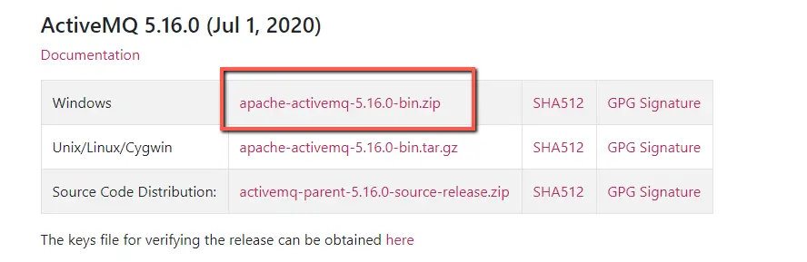
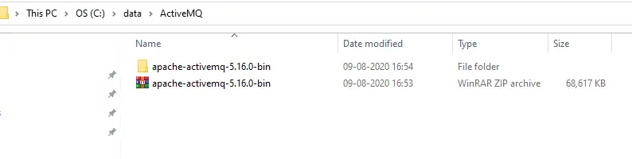
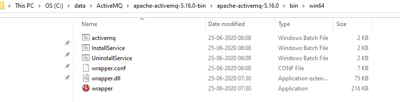
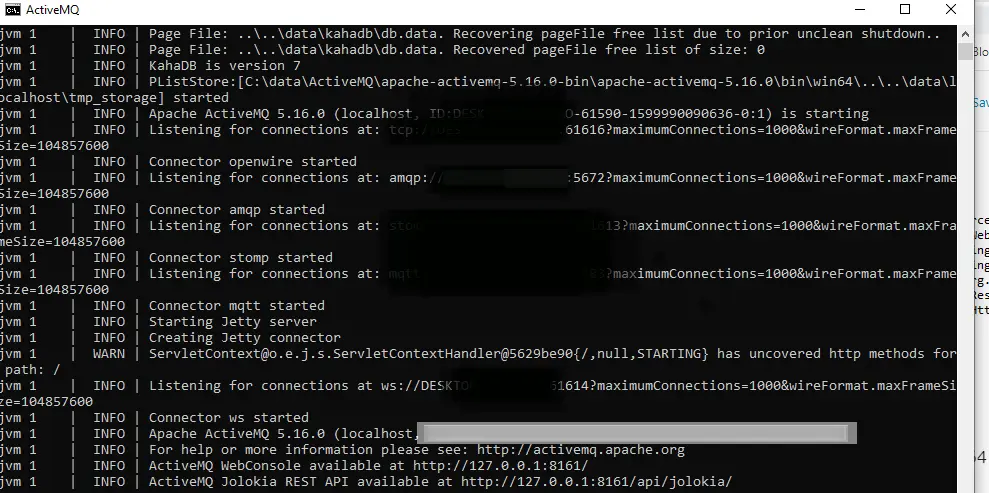
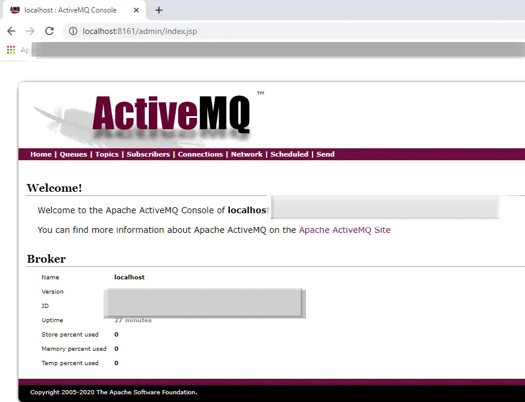

# Spring Boot JMS ActiveMQ Producer and Consumer Example

In this post we will see about Spring Boot JMS ActiveMQ Producer and Consumer Example from scratch.

We are going to cover below points
1. Points we are going to learn in this tutorial.
2. Download and Install ActiveMQ.
3. Spring Boot JMS ActiveMQ Producer and Consumer Example – Step by step tutorial from scratch.
4. Spring Boot ActiveMQ Consumer example – Defining Consumer as Rest End point.

### Points we are going to learn in this tutorial.
How to install ActiveMQ and login into ActiveMQ console.
How to create a producer endpoint to send the messages.
How to create a consumer (Using @JmsListener and controller class) to receive the messages.

Download and Install ActiveMQ.
Click on below link to download ActiveMQ.

http://activemq.apache.org/components/classic/download/

Download the zip file and extarct it.

Go to win64(or win32 depends on your machine) folder. For example.

- C:\data\ActiveMQ\apache-activemq-5.16.0-bin\apache-activemq-5.16.0\bin\win64

Double click on activemq, our ActiveMQ should get started and we should able to see below screen.

Let’s login to ActiveMQ Console using below URL.

[http://localhost:8161/admin/](http://localhost:8161/admin/)

It will ask for username and password. Default username – admin and password – admin.

Once we provide username and password we should able to see below ActiveMQ console.

