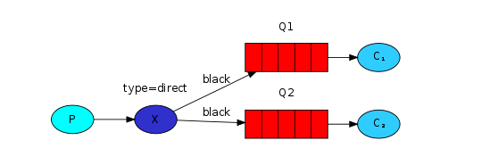
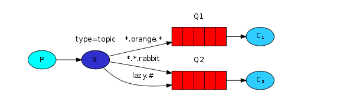
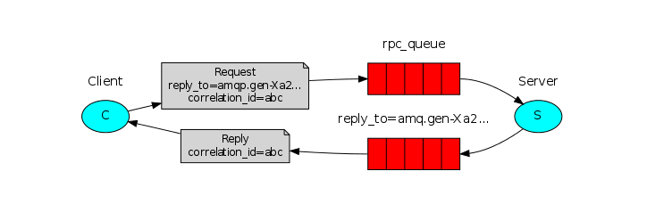

# RabbitMQ

RabbitMQ - bu message broker. xabarlarni qabul qiluvchi va yo'naltiruvchi. RabbitMQ xabar almashish jargonlaridan 
foydalanadi.

Producer - xabar yuborishdan boshqa narsani anglatmaydi. Xabarlarni yuboruvchi daster Producer deb ataladi.
Queue - xabar yuborilgan so'ng xabarlarni queueda saqlanadi. 
Consumer - qabul qilish bilan o'xshash manoga ega. Consumer asosan xabarlarni olishni kutadigan dastur.

# 2. Work Queues

## Round Robin Dispatching

RabbitMq bizga biri nechta ishchilar bilan parallel ishlash imkoni beradi yani producerlar tomondan kelayotgan xabarlarni
qayta ishlashga ulgurmayotgan Consumer bo'lsa unga qo'shimcha yana bitta yoki bir nechta Consumer ishga tushirish orqali
parallel ishlashimiz mumkin. RabbitMQ har bir xabarni Consumerga yuboradi. ketma - ketlikda. O'rtacha har bir consumer
bir xil miqdorda oladi. 

## Message acknowledgment

RabbitMQ acknowledgment xabar tasdiqlashni bildiradi yani xabar qabul qilinishi bilan tasdiqlanadi, qayta ishlanayotgan 
bo'lsa ham bu degani xabar tasdiqlanishi bilan queuedan ochirib tashlanadi. Bunday holatda consumer o'chib qolsa xabar yoqoladi.

```java
channel.basicQos(1); // accept only one unack-ed message at a time (see below)

DeliverCallback deliverCallback = (consumerTag, delivery) -> {
  String message = new String(delivery.getBody(), "UTF-8");

  System.out.println(" [x] Received '" + message + "'");
  try {
    doWork(message);
  } finally {
    System.out.println(" [x] Done");
    channel.basicAck(delivery.getEnvelope().getDeliveryTag(), false);
  }
};
boolean autoAck = false;
channel.basicConsume(TASK_QUEUE_NAME, autoAck, deliverCallback, consumerTag -> { });
```

## Message Durability

RabbitMQ ishdan chiqanidi Queuelar va Xabarlarni unitadi Agar buni qilmaslikni aytmagunimizcha. Bunga ishonch hosil qilish 
uchun 2ta narsa talab qilinadi. Biz queue ni ham, xabarni ham durable qilib belgilashimiz kerak.

## Fair dispatch

RabbitMQ bir nechta consumer orqali xabarlarni qabul qilib ko'rgan bo'lsangiz korgan bolishingiz mumkin ularni 1ta doim
ishlaydi qolganlari esa yoq. Bu narsa RabbitMQ tasdiqlanmaganlarni soniga qaramaganligi uchun shunday boladi.

```java
int prefetchCount = 1; 
channel.basicQos(prefetchCount);
```

Buni oldini olish uchun `basicQos` methodidan foydalanishimiz mumkin. Tepadagi kodni ko'rgan bo'lsangiz ushbu sozlama
Consumerga 1tadan ortiq tasdiqlanmagan xabar bermasligini bildiradi yani bir vaqtning o'zida faqat bitta xabar. Xabar 
tasdiqlanmaguncha rabbitMq unga yangi xabarni bermaydi. Buning o'rniga band bo'lmagan boshqa consumerlarga xabar jo'natadi.

# 3. Publisher/Subscriber

## Exchange

RabbitMQ dagi xabar almashish modelidagi asosiy g'oya bu producer hech qachon to'g'ridan to'g'ri queue ga hech qanday xabar 
yubormaydi. 

Buning o'rniga Producer faqat almashinuvga yani `exchange` ga xabar yuborishi mumkin. Exchange juda oddiy narsa. Bir tomondan
xabarlarni qabul qiladi va boshqa tomon ularni queuega yuboradi. Ayirboshlash qabul qilingan xabar bilan nima qilish 
kerkaligni aniq bilishi kerak. Bir nechta queuelarga berishi kerakmi? yoki uni tashlab yuborishi kerakmi. Buning uchun
qoidalar tomonidan belgilanadi almashinuv turi yani exchange type

Bir nechta almashinuv turlarni mavjud ular:

- direct
- topic
- headers
- fanout

```java
channel.exchangeDeclare("logs", "fanout");
```

`Fanout` exchange juda oddiy. U faqat qabul qilingan xabarlarni hammaga uzatadi. binding keylarni ignore qiladi.
shuning uchun ularni bosh bergan maqul.


## Bindings

Biz allaqachon fanout almashinuvini yaratganmiz. Endi biz almashinuvga bizning queuelarimizga xabarlarini yuborishini
aytishimiz kerak. Ushbu jarayon almashish va queue o'rtasidagi bog'lanish yani binding deyiladi. Qisqa qilib aytganda
binding - bu almashinuv va queue o'rtasidagi munosabat.


```java
channel.queueBind(queueName, "logs", "");
```

bundan buyon `logs` almashinuv xabarlarni queuega qo'shib boradi.

# 4. Routing

## Direct Exchange

Bundan oldingi qo'llanmamizda ro'yxatga olish tizimi barcha xabarlarni uzatadi barcha consumerlarga. Biz endi xabarlarni
filterlashga ruxsat berish uchun uni kengaytirmoqchimiz ularning jiddiyligiga qarab. 

Biz `fanout` almashuv turidan foydalandik. Endi `direct` almashinuvidan foydalanamiz. Orqada routing algorithmi `direct`
oddiy almashish. Xabar endi queuelarga binding_key orqali o'tadi. binding key va routing key to'liq bir biriga mos kelsa.


## Multiple bindings

Bir xil bog'lovchi bilan bir nechta queuelarni boglash mutlaqo mumkin. Bizning misolimizda `X` va `Q1` bilan bog'lanishni
qo'shishimiz mumkin. Bog'lovchi kalit yani binding key `black`. Routing key `black` bo'lgan xabar ikkala queue ga ham 
yetkaziladi `Q1` va `Q2`.



# 5. Topic Exchange

topic exchange orqali yuborilgan xabarlarni routing_keyi ixtiyoriy so'zlaridan iborat bo'lishi mumkin emas. Nuqtalar bilan ajratilgan
so'zlar ro'yxat bo'lishi kerak. So'zlar har qanday bo'lishi mumkin. Misol uchun `stock.usd.nyse`, `nyse.vmw`, `quick.orange.rabbit`

Bog'lash kaliti yani binding key ham bir xil shaklda bo'lishi kerak. Topic ortidagi logika direct exchange dan yuborilgan
xabarga o'xshaydi. Maxsus routing key barcha queuelarga yetkaziladi mos keladigan binding key bilan bog'langan. Biroq
2ta narsa bor kalitlarni ulash uchun maxsus holatlar.

- `*` (yulduzcha) aynan bitta so'z o'rnini
- `#` (xesh) nol yoki undan ortiq so'z o'rinni bosishi mumkin.



Biz uchta binding yaratdik. Q1 `*.orange.*` va Q2 da `*.*.rabbit` va `lazy.#`

- Q1 - barcha apelsin hayvonlarga qiziqadi.
- Q2 - quyonlar haqida hamma narsani va dangasa haqida hamma narsani eshitishni xohlaydi.

ushbu routing key `quick.orange.rabbit` bilan yuborilgan xabar ikkala queuega ham yetkaziladi. `lazy.orange.elephant`
ham ikkala queuega boradi. Boshqa tarafdan `quick.orange.fox` faqat Q1 ga yuboriladi va `lazy.brown.fox` faqat Q2 ga 
yuboriladi. `lazy.pink.rabbit` faqat bir marta Q2 ga yuboriladi garchi u 2ta bog'lanishga yani binding_key ga mos kelsa
ham. `quick.brown.fox` hech qanday bog'lovchiga mos kelmaydi, shuning uchun u o'chirib tashlanadi. 

Agar biz topic shartnomasini buzsak va bitta yoki 3ta kop sozli xabar yuborsak nima sodir bo'ladi. Masalan `orange` yoki
`quick.orange.new.rabbit` Xo'sh, bu xabarlar hech qanday bog'lanishga mos kelmaydi va yo'qoladi. 

Boshqa tomondan `lazy.orange.new.rabbit` garchi u to'rta bo'lsa ham, oxirgi bog'lovchiga mos keladi va Q2 yetkaziladi. 

# 6. Remote Procedure Call (RPC)

Umuman olganda RabbitMQ da RPC oson. Client so'rov yuboradi xabarini yuboradi va server javob xabari bilan javob beradi.

## Message Properties

- `replyTo` - Odatda qayta qo'ng'iroq queue ni nomlash uchun foydalaniladi.
- `correlationId` - RPC Javoblarni requestlar bilan bog'lash uchun ishlatiladi.

## Correlation Id

Correlation Id - serverdan qaytgan javob qaysi request teshli ekanligini aniqlashimiz uchun kerak. Biz uni unique
qilib belgilashimiz kerak har bir request uchun. 

