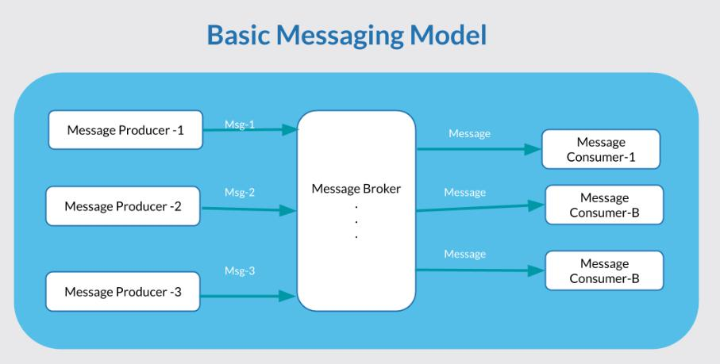
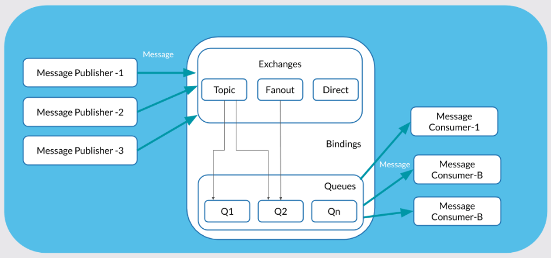

# Here simple RabbitMQ pub/sub configuration project


**_run rabbitmq on docker machine_**

```shell
 docker run -d --hostname my-rabbit -p 15672:15672 -p 5672:5672 --name some-rabbit rabbitmq:management
```

Messaging is not new in Java world, developers have been using it with the help of JMS in Java. However, JMS is not truly interoperable as it is tightly coupled with the JVM and Java world. Big Organisations like JP Morgan, CISCO, Microsoft, RedHat, etc came together to create a truly interoperable messaging standard known as AMQP (Advanced Message Queuing Protocol). AMQP is one of the protocols RabbitMQ supports.

* A Message broker is an agent who guarantees the message delivery. The rules a message broker understands is known as messaging protocol.

## What is RabbitMQ?
RabbitMQ is an open-source message broker, licensed under the MPL 1.1. It is part of Pivotal software Inc (now owned by VMware). It has several features and benefits as listed below. It is popular in startups as well as big organizations.

RabbitMQ is written in Erlang, designed for a distributed, fault-tolerant, soft real-time systems with almost 99.999% uptime.

## Features and benefits of RabbitMQ
- Open Source – Released under Mozilla Public License 1.1.
- Multiple message protocols – AMQP, MQTT, STOMP, HTTP.
- Lightweight – A single instance can run in less than 40MB of RAM.
- Client library support – All modern programming languages like Java, Python, JavaScript, Erlang, etc today have RabbitMQ client library.
- Highly Scalable architecture – Easily deploy a cluster of RabbitMQ.
- Enterprise and Cloud-ready – Flexible enough to deploy on-premise infrastructure or in cloud infra.
- Management & Monitoring – HTTP-API, command-line tool, and UI for managing and monitoring.

## Who is using RabbitMQ?
- Google uses RabbitMQ in their several products. Google Cloud Platform also offers RabbitMQ.
- BBC uses it for the real-time news feed.
- Reddit uses in its core application.
- Mozilla uses RabbitMQ in Pulse.


## What is AMQP – Advanced Message Queuing Protocol?
The Advanced Message Queuing Protocol is an open standard for passing business messages between applications.  It connects systems, feeds business processes with the information they need and reliably transmits onward the instructions that achieve their goals.

If you have read my articles on JMS, I clearly mentioned the limitations of JMS such as Security, Scalability, etc. But AMQP is designed to eliminate such limitations.

AMQP was designed with the following main characteristics as goals: Security, Reliability, Interoperability, Open standard.

## Basic components of a Messaging system

Any messaging system is made up of 4 important components, Message Producers, Message Consumers, Message Brokers, and the message itself.



## Elements of the AMQP system

AMQP stands for Advanced Message Queuing Protocol, it creates the interoperability between Producer, Message Broker, and the Consumer. Just like any messaging system, a producer/publisher creates a message and sends the message to an Exchange. Then the Exchange routes the message to one or more Queues depending upon the related Bindings


