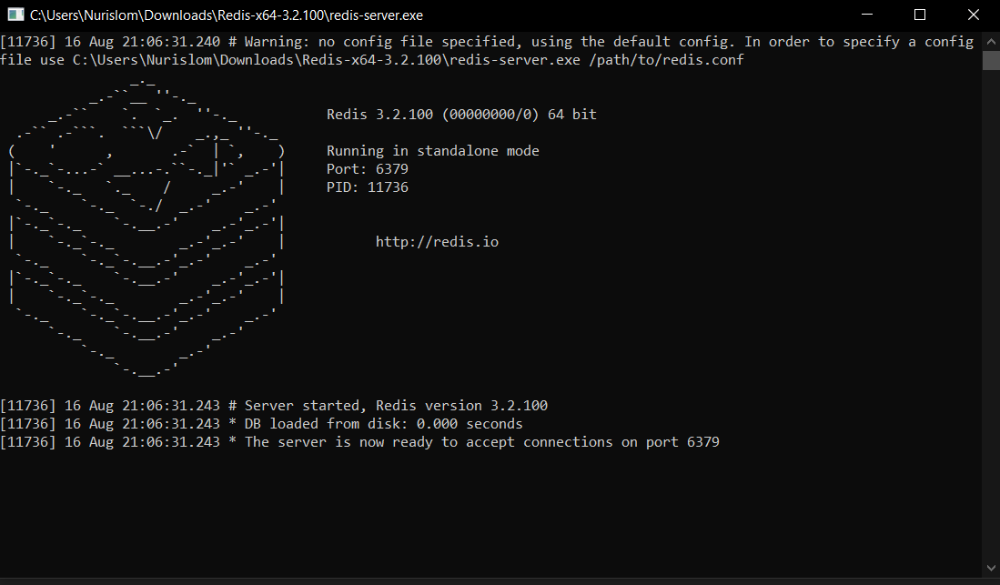

# What is a message broker?

Modern software applications have moved from being a single monolithic unit to loosely coupled collections of services. While this new architecture brings many benefits, those services still need to interact with each other, creating the need for robust and efficient messaging solutions.

Redis Streams doubles as a communication channel for building streaming architectures and as a log-like data structure for persisting data, making Streams the perfect solution for event sourcing.

Redis Pub/Sub is an extremely lightweight messaging protocol designed for broadcasting live notifications within a system.
It’s ideal for propagating short-lived messages when low latency and huge throughput are critical.

Redis Lists and Redis Sorted Sets are the basis for implementing message queues. They can be used both directly to build bespoke solutions, or via a framework that makes message processing more idiomatic for your programming language of choice.

run redis server command 'start redis-server' bash

